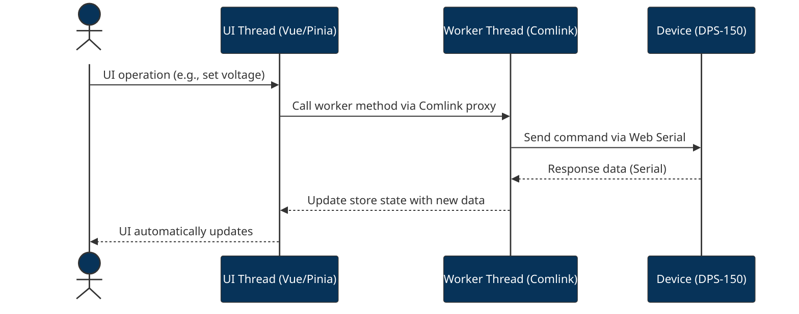

WebSerial / JavaScript implementation for FNIRSI - DPS-150
=========================================================


[](https://www.youtube.com/watch?v=_RqsPEhD9YM )


This is a simple implementation of the FNIRSI - DPS-150 protocol in JavaScript. It is intended to be used with the WebSerial API, which is currently only available in Chrome.

https://www.fnirsi.com/products/dps-150

## FNIRSI - DPS-150

The FNIRSI - DPS-150 is a CNC power supply working with USB-PD.

This power supply can be controlled via USB. Officially, however, only software for Windows is provided.

## Project Architecture

This project has been refactored into a modern web application using Vue.js, TypeScript, and Vite. The architecture separates the user interface from the device communication logic.

-   **`src/`**: The main source directory.
    -   **`main.ts`**: The entry point of the Vue application.
    -   **`App.vue`**: The root Vue component.
    -   **`components/`**: Contains all Vue components for the UI.
    -   **`store/device.ts`**: A [Pinia](https://pinia.vuejs.org/) store that manages the application state.
    -   **`core/`**: Contains the core logic for device communication.
        -   **`dps-150.ts`**: The low-level implementation of the FNIRSI DPS-150 communication protocol.
        -   **`worker.ts`**: A Web Worker that handles all serial communication, preventing the UI from freezing. It uses [Comlink](https://github.com/GoogleChromeLabs/comlink) to communicate with the main thread.

This structure separates protocol logic, UI, and background processing for maintainability and clarity.



## Getting Started

This project uses [Yarn](https://yarnpkg.com/) as the package manager.

1.  **Install dependencies:**
    ```sh
    yarn install
    ```

2.  **Run the development server:**
    ```sh
    yarn dev
    ```

Then open the displayed local URL in a browser that supports the [Web Serial API](https://developer.mozilla.org/en-US/docs/Web/API/Web_Serial_API) (e.g., Google Chrome, Edge, Opera).

## Protocol

*All of this is speculative and not accurate.*

The protocol is via serial communication. The command has the following format for both input and output.


| byte | description |
|------|-------------|
|    0 | start byte 0xf1 (out) or 0xf0 (in) |
|    1 | command |
|    2 | type |
|    3 | length of data |
|  4-n | data |
|    n | checksum |

all `float` value is in little-endian format.

### Command

| byte | decimal | description |
|------|---------|-------------|
| 0xa1 |     161 | get value   |
| 0xb0 |     176 | ?           |
| 0xb1 |     177 | set value |
| 0xc0 |     192 | ? |
| 0xc1 |     193 | connection? |


### Calculation of the checksum

```
checksum = (bytes[2] + bytes[3] ... bytes[n-1]) % 256
```
